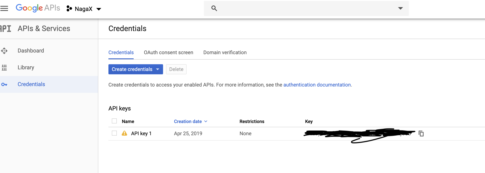
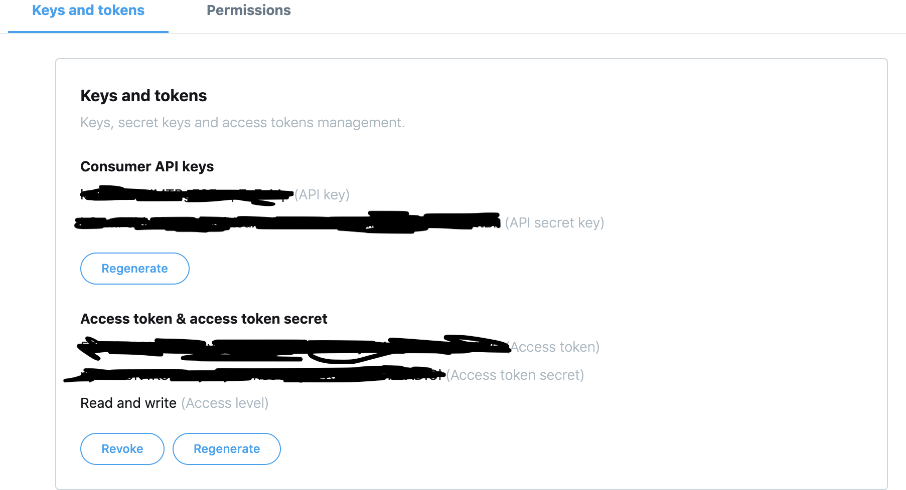

#  Setup API Key On Youtube and Twitter | Part 3

### Setting up youtube api key on developer console

Go to the [Google developer console](https://console.developers.google.com/apis/library) and search for youtube data api and `enable` the service. 

There are only one key will be needed at the google developer console



---

### Installation for youtube package

Next, go to the [alaouy youtube api for laravel](https://github.com/alaouy/Youtube) and run the following command to install the laravel package for youtube:

```
composer require alaouy/youtube
```

---

### For configuration on youtube

After install the package, go to the `/config/app.php` add YoutubeServiceProvider:

```
Alaouy\Youtube\YoutubeServiceProvider::class,
```

Do not forget to add Youtube Facade there:

```
'Youtube' => Alaouy\Youtube\Facades\Youtube::class,
```

Then, publish config settings:

```
$ php artisan vendor:publish --provider="Alaouy\Youtube\YoutubeServiceProvider"
```

Set your Youtube API key in the file:

```
/config/youtube.php
```

Or in the .env file

```
YOUTUBE_API_KEY = KEY
```

---

### Setting up twitter api key and access token 

Go to the [Twitter developer account](https://developer.twitter.com/content/developer-twitter/en.html) to create a new developer account if you have an account then login to the account. Then, go to the dashboard and `Create an app`. 


After created the app, go to the Keys and tokens section and there will be 4 types of keys. 



---

### Installation for twitter package

Next, go to the [thujohn twitter for laravel](https://github.com/thujohn/twitter) and run the following command to install the laravel package for twitter:

```
composer require thujohn/twitter
```

Now open up /config/app.php and add the service provider to your providers array.

```
'providers' => [
	Thujohn\Twitter\TwitterServiceProvider::class,
]
```

Now add the alias.
```
'aliases' => [
	'Twitter' => Thujohn\Twitter\Facades\Twitter::class,
]
```

---

# Configuration

### Laravel 5

For laravel 5 run `php artisan vendor:publish --provider="Thujohn\Twitter\TwitterServiceProvider"`and modify the config file with your own information.

```
/config/ttwitter.php
```

With Laravel 5, it's simple to edit the config.php file - in fact you don't even need to touch it! Just add the following to your .env file and you'll be on your way:

```
TWITTER_CONSUMER_KEY=
TWITTER_CONSUMER_SECRET=
TWITTER_ACCESS_TOKEN=
TWITTER_ACCESS_TOKEN_SECRET=
```


